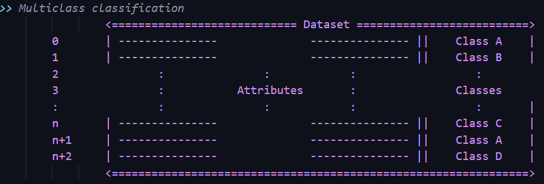
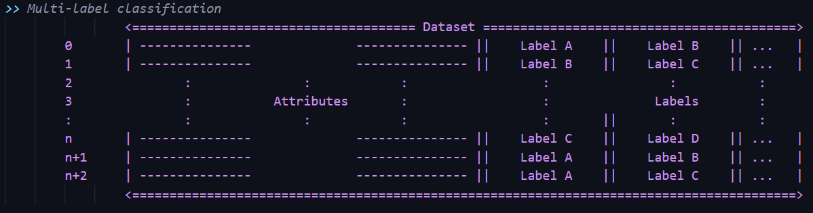

# Implementing multi-label classification algorithms - (work in progress)

## What is multi-label classification?

* To understand multi-label classification, lets first understand simple multi-class classification that is used in most of the places.
 
    Multi-class Classification (MCC) : A single instance of training data is assigned to a single class amongst the group of classes {Ci} where i ∈ (0, n) where n can be any number that the problem has. MCC is very common heuristic used to classify instances of data into categories based on classes. A key observation here is,  each instance can be associated with atmost one class at any given instance of time 't'.

    Multi-label classification (MLC): It is a generalization of multi-class classification where a single instance can be assigned to multiple classes aka 'labels' at a given instance of time 't'

    Understanding difference between MCC and MLC visually -
    
    
    
    ------
    
    

## Multi-label classification algorithms

### Binary Relavance Classification

### Classifier Chains

### Classifier Chains Random Ordering

### Classifier Chains Using Monte-Carlo Algorithm